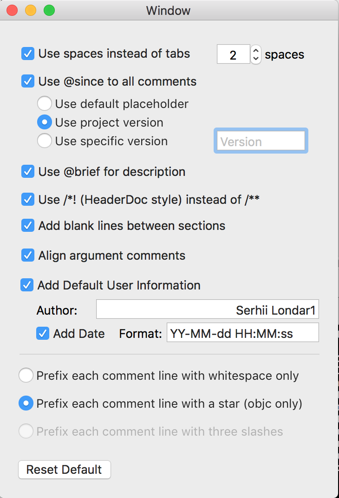

# DocumenterXcode
This project is an attempt to give a new life for [VVDocumenter-Xcode](https://github.com/onevcat/VVDocumenter-Xcode) for Xcode as source editor extension.

This repository contains settings app and xcode source editor extension.

  

## Example of usage:

