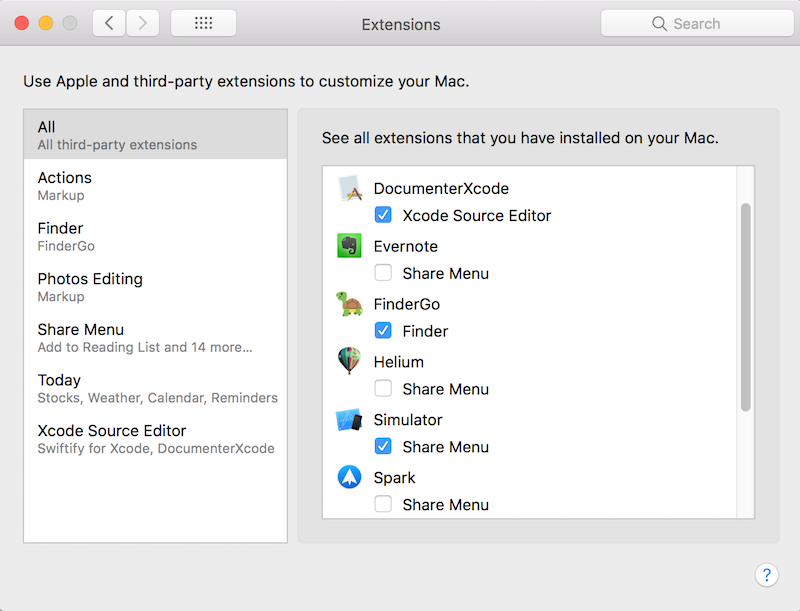

# DocumenterXcode
Xcode source editor extension which helps you write documentation comment easier, for both Objective-C and Swift.

This project is an attempt to give a new life for [VVDocumenter-Xcode](https://github.com/onevcat/VVDocumenter-Xcode) for Xcode as source editor extension.

This repository contains settings app and xcode source editor extension.

## What is this?
Writing documentation is so important for developing, but it is really painful with Xcode. Starting from Xcode 9 apple added support for code documenting. This project is providing more flexible code documenting process. You can use various settings to write your documentation. 

## 

  

## How to install and use:

### Install
You can build it by your own, just checkout this repo, open DocumenterXcode.xcodeproj and press run.

Also you can Download app and extension from [releases](https://github.com/serhii-londar/DocumenterXcode/releases).

Do not forget to enable Documenter Xcode in Settings: 

### Usage

To create documentation fou your method you need to set cursor about this methot and execute extension using : Editor -> DocumenterXcodeExtension -> Comment. 

## TO DO

- [ ] Fix issue with swift documenting.
- [ ] Support swift 3.0 and more. 
- [ ] Rewrite to swift.

## License

DocumenterXcode is published under MIT License. See the LICENSE file for more.